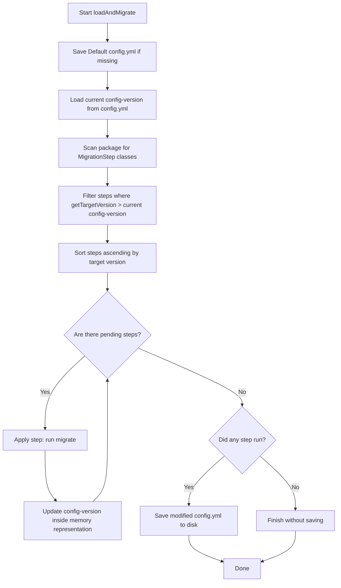

# Explanation & Rules

To ensure reliable migrations, it is important to understand how MC Config Libs discovers and executes your migration steps under the hood.

---

## Migration Rules

Every migration step class must adhere to the following rules:

1.  **Implements `MigrationStep`**: Your class must directly implement `org.yuemi.config.api.MigrationStep`.
2.  **Public Access**: The class must be `public`.
3.  **No-Arg Constructor**: The class must have a public no-argument constructor (either default or explicit) so the library can instantiate it.
4.  **No Inner/Abstract Classes**: Non-static inner classes and abstract classes are automatically ignored by the classpath scanner.

---

## How It Works

When `ConfigManager#loadAndMigrate` is executed, the following actions take place:

### Classpath Scanning
The library scans the package name provided in the constructor. Because plugins might run from a standard jar file on a live server, or straight from class folders in an IDE/test environment, MC Config Libs uses a robust dual scanning system:
*   **File Scan**: Used during development or inside IDE testing when class files are placed in normal directories.
*   **Jar Scan**: Used on production servers when the class files are packed inside a `.jar` archive.

### Version Sorting & Ordering
All discovered migration steps are sorted based on their `getTargetVersion()`. The manager executes steps sequentially:
*   A configuration at version `1` will run a step with target version `2`.
*   Once finished, the version in the config file is updated to `2` in memory, allowing a step with target version `3` to run next.
*   If a migration step fails or throws an exception, the migration process is halted to prevent configuration corruption.
